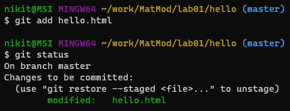
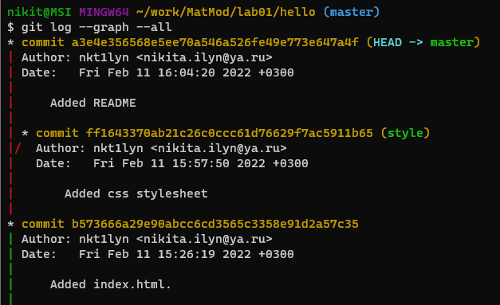
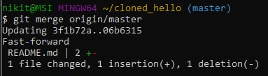

---
# Front matter
title: "Отчет по лабораторной работе №1"  
subtitle: "Использование git"  
author: "Ильин Никита Евгеньевич"  
group: "NFIbd-01-19"    
institute: "RUDN University"  
date: "2022 Feb 10th"  

# Generic otions
lang: ru-RU
toc-title: "Содержание"

# Bibliography
bibliography: bib/cite.bib
csl: pandoc/csl/gost-r-7-0-5-2008-numeric.csl

# Pdf output format
toc: true # Table of contents
toc_depth: 2
lof: true # List of figures
lot: true # List of tables
fontsize: 12pt
linestretch: 1.5
papersize: a4
documentclass: scrreprt
## I18n
polyglossia-lang:
  name: russian
  options:
	- spelling=modern
	- babelshorthands=true
polyglossia-otherlangs:
  name: english
### Fonts
mainfont: PT Serif
romanfont: PT Serif
sansfont: PT Sans
monofont: PT Mono
mainfontoptions: Ligatures=TeX
romanfontoptions: Ligatures=TeX
sansfontoptions: Ligatures=TeX,Scale=MatchLowercase
monofontoptions: Scale=MatchLowercase,Scale=0.9
## Biblatex
biblatex: true
biblio-style: "gost-numeric"
biblatexoptions:
  - parentracker=true
  - backend=biber
  - hyperref=auto
  - language=auto
  - autolang=other*
  - citestyle=gost-numeric
## Misc options
indent: true
header-includes:
  - \linepenalty=10 # the penalty added to the badness of each line within a paragraph (no associated penalty node) Increasing the value makes tex try to have fewer lines in the paragraph.
  - \interlinepenalty=0 # value of the penalty (node) added after each line of a paragraph.
  - \hyphenpenalty=50 # the penalty for line breaking at an automatically inserted hyphen
  - \exhyphenpenalty=50 # the penalty for line breaking at an explicit hyphen
  - \binoppenalty=700 # the penalty for breaking a line at a binary operator
  - \relpenalty=500 # the penalty for breaking a line at a relation
  - \clubpenalty=150 # extra penalty for breaking after first line of a paragraph
  - \widowpenalty=150 # extra penalty for breaking before last line of a paragraph
  - \displaywidowpenalty=50 # extra penalty for breaking before last line before a display math
  - \brokenpenalty=100 # extra penalty for page breaking after a hyphenated line
  - \predisplaypenalty=10000 # penalty for breaking before a display
  - \postdisplaypenalty=0 # penalty for breaking after a display
  - \floatingpenalty = 20000 # penalty for splitting an insertion (can only be split footnote in standard LaTeX)
  - \raggedbottom # or \flushbottom
  - \usepackage{float} # keep figures where there are in the text
  - \floatplacement{figure}{H} # keep figures where there are in the text
---

# Цель работы

Цель данной работы --- Изучение основ работы с системой контроля версий git.

# Задание
| Номер задачи | Описание задачи                                                                                                          |
|--------------|----------------------------------------------------------------------------------------------------------------------------|
|1.1| Подготовка к работе с git.|
|1.2| Создание проекта.|
|1.3| Внесение изменений в файлы.|
|1.4| Индексация изменений.|
|1.5| Отмена локльных изменений (до индексации).|
|1.6| Отмена проиндексированных изменений.|
|1.7| Отмена коммитов.|
|1.8| Удаление коммитов из ветки.|
|1.9| Удаление тега oops.|
|1.10| Внесение изменений в коммиты.|
|1.11| Перемещение файлов.|
|1.12| Второй способо перемещения файлов.|
|1.13| Подробнее о структуре.|
|1.14| Git внутри: Каталог .git.|
|1.15| Работа непосредственно с объектами git.|
|1.16| Создание ветки.|
|1.17| Навигация по веткам.|
|1.18| Изменения в ветке master.|
|1.19| Сделайте коммит изменений README.md в ветку master.|
|1.20| Слияние.|
|1.21| Создание конфликта.|
|1.22| Разрешение конфликтов.|
|1.23| Сброс ветки style.|
|1.24| Сброс ветки master.|
|1.25| Перебазирование.|
|1.26| Слияние в ветку master.|
|1.27| Клонирование репозиториев.|
|1.28| Просмотр клонированного репозитория.|
|1.29| Что такое origin?|
|1.30| Удаленные ветки.|
|1.31| Изменение оригинального репозитория.|
|1.32| Слияние извлеченных изменений.|
|1.33| Добавление ветки наблюдения.|
|1.34| Чистые репозитории.|
|1.35| Создайте чистый репозиторий.|
|1.36| Добавление удаленного репозитория.|
|1.37| Отправка изменений.|
|1.38| Извлечение общих изменений.|

# Теоретическое введение

| Имя каталога | Описание каталога                                                                                                          |
|--------------|----------------------------------------------------------------------------------------------------------------------------|
| `/`          | Корневая директория, содержащая всю файловую                                                                               |
| `/bin `      | Основные системные утилиты, необходимые как в однопользовательском режиме, так и при обычной работе всем пользователям     |
| `/etc`       | Общесистемные конфигурационные файлы и файлы конфигурации установленных программ                                           |
| `/home`      | Содержит домашние директории пользователей, которые, в свою очередь, содержат персональные настройки и данные пользователя |
| `/media`     | Точки монтирования для сменных носителей                                                                                   |
| `/root`      | Домашняя директория пользователя  `root`                                                                                   |
| `/tmp`       | Временные файлы                                                                                                            |
| `/usr`       | Вторичная иерархия для данных пользователя                                                                                 |

# Выполнение лабораторной работы

1. Указываем имя и электронную почту для git  

2. Устанавливаем параметры установки окончаний строк  

3. Устанавливаем отображение unicode  

4. Создаем страницу Hello World  
  
5. Создаем репозиторий  
  
6. Добавление файла в репозиторий  

7. Проверяем состояние репозитория  

8. Изменяем страницу Hello World  

9. Индексируем изменения  

10. Коммит изменений  
  

11. Добавляем стандартные теги страницы  
  
  
  
  
  
12. История изменений  
  
  
13. Получение старых версий  
  
  
14. Создание тегов версий  
  
  
  
  
15. Переключение по имени тега  
  
  
16. Просмотр тегов с помощью команды tag  
  
17. Переключаемся на ветку master  
18. Изменяем файл hello.html  
19. Проверяем состояние  
  
20. Отменяем изменения в рабочем каталоге  
  
21. Измененяем файл и индексируем изменения  
  
22. Проверьте состояние  
  
23. Выполняем сброс буферной зоны  
  
24. Переключаемся на версию коммита  
  
25. Отменяем коммит  

26. Изменяем файл и делаем коммит  

27. Делаем коммит с новыми изменениями, отменяя предыдущие  

28. Проверяем лог  

29. Выполняем команду git reset  
30. Проверяем историю  

31. Отмечаем ветку  

32. Делаем сброс коммитов к предшествующим коммиту Oops  

33. Удаление тега Oops  

34. Изменяеем страницу и делаем коммит  

35. Изменяем предыдущий коммит  

36. Перемещаем файл hello.html в каталог lib  

37. Делаем коммит в новый каталог  

38. Добавляем файл Index.html  

39. Каталог .git  

40. Углубляемся в базу данных объектов  

41. Открываем Config файл  

42. Ветки и теги  

43. Открываем файл HEAD  

44. Поиск последнего коммита  

45. Вывод коммита с помощью SHA1 хэша  

46. Поиск дерева  

47. Вывод каталога lib  

48. Вывод файла hello.html  

49. Создаем ветку  

50. Добавляем файл стилей style.css  

51. Изменяем файл index.html  

52. Переключаемся на ветку master  

53. Возвращаемся к ветке style  

54. Создаем файл README в ветке master  

55. Делаем коммит изменений  

56. Просматриваем текущие ветки  

57. Выполняем слияние веток  

58. Создаем конфликт  

59. Выполняем слияние веток master и style, и решаем конфликт  

60. Делаем коммит решения конфликта  

61. Сброс ветки style. Проверяем ветку  

62. Сброс ветки master  

63. Перебазирование  

64. Слияние style в master  

65. Изменяем оригинальный репозиторий  

66. Проверяем README  

67. Сливаем извлеченные изменения  

68. Добавляем локальную ветку, отслеживающую оригинальную  

69. Отправляем изменения  

70. Извлекаем общие изменения  

# Выводы

В ходе данной работы были получены навыки использования системы контроля версий git. А также работы с сервисом GitHub.

